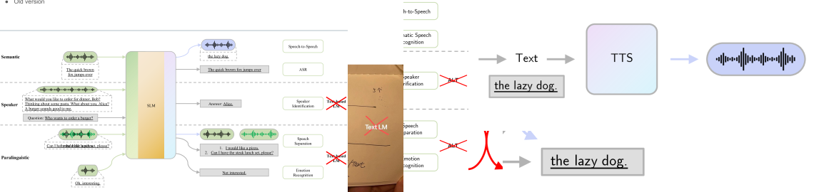

# Unlocking the Ultimate AI Voice Assistant: Modular vs. End-to-End, Low Latency, and Open Source Excellence

AI voice assistants, the kind of thing we used to only see in sci-fi movies, are now everywhere in our pockets, in smart homes, even in cars. Thanks to **Large Language Models (LLMs)**, these assistants grew up fast. They’re no longer those clunky chatbots that barely understood “hello”; now they can actually hold a conversation without embarrassing themselves.  
For developers and product teams anywhere dreaming of building the next killer voice agent, understanding the architecture and how to optimize performance is as important as your morning cup of coffee on a Monday.

---

## The Architecture Showdown: Modular vs. End-to-End

There are basically two schools of thought when building voice assistants: the classic **modular pipeline** and the trendy new **end-to-end** systems. So you face a fundamental decision: rely on the tried-and-true modular pipeline, or venture into the emerging world of integrated systems.

### 1. The Modular Approach (ASR + LLM + TTS)

This is the stable, production-grade approach. It runs as a pipeline of three clear steps:

1. **ASR (Speech-to-Text):** Takes your voice and converts it into text. **The translator.**
2. **LLM (The Brain):** Processes the text, understands what you want, and figures out a response. **The brain**
3. **TTS (Text-to-Speech):** Converts the response back into speech. **The parrot**

The beauty of this modular design, is flexibility: you can **"pick and choose"** mixing and matching the best models for each stage, perfect for building custom AI voice assistants. However, this staged approach suffers from two curses: **information loss** (paralinguistic details like tone and emotion are lost when converting to text) and **cumulative errors** (any mistake in the ASR phase propagates and hurts the LLM's understanding).
Espicially when using an under represented language in the model training, like the arabic egyptian accent, will dive into this in few moments.
The emotion discarding can be tackled using a seperate emotion detection model, but that would increase resources consumption and increase cost.

picture is from [Recent Advances in Speech Language Models: A Survey](https://arxiv.org/html/2410.03751v1)

### 2. The End-to-End Approach: The Future (SpeechLMs)

This is the hot new thing. Instead of breaking the process down, **Speech Language Models (SpeechLMs)** go straight from speech input to speech output, skipping the text middleman. Models like GPT-4o are pushing this direction.

**Why the shift?** SpeechLMs directly encode speech waveforms into discrete tokens, which captures semantic information while retaining valuable **paralinguistic information** (like pitch and timbre). By integrating the process, they effectively **mitigate cumulative errors** present in the old pipeline.

| Feature            | Modular (ASR + LLM + TTS)               | End-to-End (SpeechLM/STS)                                   |
| :----------------- | :-------------------------------------- | :---------------------------------------------------------- |
| **Data Flow**      | Speech → Text → LLM → Text → Speech     | Speech → Tokens → LLM → Tokens → Speech                     |
| **Latency/Errors** | Errors can stack up like Cairo traffic. | Much cleaner, fewer “accidents.”                            |
| **Context**        | Loses tone/emotion along the way.       | Keeps the drama, tone, pitch, emotion.                      |
| **Error**          | Cumulative errors propagate             | Effectively mitigates cumulative errors                     |
| **HW usage**       | Can be optimized for everystep          | The whole package is delivered as it is take it or leave it |

**End-to-End Example: DiVA and GPT-4o**

Integrated systems are emerging, signaling a major industry shift. For instance, **DiVA** (Distilling an End-to-End Voice Assistant) is an open-source unified framework handling ASR, TTS, and speech enhancement. Similarly, the **GPT-4o model** is noted as an integrated system aiming to handle speech-to-text, processing, and text-to-speech within a single model.
Problem encountered while starting up DiVA is huge resources consumption, tried starting it in kaggle using 2xT4 GPUs, and the kerneal restarted because of a buffer overflow before loading it.

---

## Fighting Latency (Because Nobody Likes Waiting)

For a voice assistant to feel natural, it has to be fast under few seconds total delay. Nobody wants to ask “what’s the weather?” and get the answer after they’ve already hung the laundry.

Top tricks for speed:

1. **Streaming & Parallel Processing:** The LLM starts sending sentences to the TTS before finishing the whole reply. Think of it like a waiter who brings you bread before the main dish is ready.
2. **Efficient ASR:** Conformer-based streaming ASR models + partial transcription. The system can already start responding before you even finish your sentence or print partial transcripts to show the user that we care.
3. **Edge Computing + WebSockets:** Processing closer to the source = faster responses. Plus, WebSockets keep the conversation flowing smoothly.
4. **Optimization Techniques:** Using binary serialization (like `msgpack`) instead of bulky text makes the pipeline faster. (Fighting for that extra 1 ms)
5. **Metrics:** To track success, monitor **Time-to-First-Token (TTFT)**, **Token Generation Time** and **Time-to-First-Audio (TTFA)**, key indicators of how quickly the system begins generating and speaking its response.
   Metrics to watch:

- **TTFT (Time-to-First-Token)**: How fast the brain starts thinking.
- **TTFA (Time-to-First-Audio)**: How fast it actually opens its mouth.
- **Token Generation Time**: How much time does each model take from the call to final output, can be measured for each model to see which needs optimization the most.

---

## Multilingual Handling (Because English already took enough from the world not giving them my tongue)

Modern assistants need to switch languages easily, in Egypt, it might even need to handle Arabic + English in the same sentence, but nearly all models struggle to speak or respond correctly in other languages. Performance can show **significant accuracy drops in languages like Arabic**. While **code switching** (mixing languages) is often handled correctly in the transcription (ASR) phase, the problem surfaces in the generation (TTS) output.

- **Multilingual ASR:** Whisper is the go-to, supporting loads of languages, and handles the automatic languge detection, but doesn't support streaming.
- **Seamless (Meta):** Handles speech-to-speech (doesn't have auto language detection must be explicitly specified) and text-to-speech translation across 100 languages.

---

## Hardware: What You’ll Need

To achieve low latency and manage the immense **GPU resources** required for LLMs and real-time processing, aggressive optimization is mandatory.
The GPU is the backbone. Pick wisely:

| Workload           | Recommended GPUs           | Notes                        |
| :----------------- | :------------------------- | :--------------------------- |
| **Small Projects** | Nvidia GTX 1660 / RTX 3050 | Fine for experiments         |
| **Mid-Level**      | RTX 3060 / 4060            | Good for fine-tuning models. |
| **Heavy Duty**     | Nvidia A100 / H100         | The real deal for production |

Here are some techniques for efficiency:

1.  **Quantization:** This technique reduces the precision of the model weights (e.g., from 32-bit to 4-bit). **4-bit LLM quantization** significantly reduces the GPU memory footprint, enabling **faster inference** without notable quality degradation (often preserving over 95% of original performance).
2.  **Exporting to ONNX:** To maximize inference speed, developers can convert their models to the **ONN)** format. For instance, optimized Whisper inference using C++ and CTranslate2 can be up to **4 times faster** than the original implementation and uses less memory. Tools within the open-source community, such as the `sherpa-onnx` repository, include scripts specifically for exporting Whisper models to ONNX. This efficiency can be further boosted by applying **8-bit quantization** during the C++ implementation.

And remember: on-device is faster and private, but expensive. Cloud is cheaper and scales better, pick your poison.

---

## Treasures of the Open Source

If you don’t want to reinvent the wheel, here are some solid open-source options:

| Component        | Examples                                          | Notes                                                                       |
| :--------------- | :------------------------------------------------ | :-------------------------------------------------------------------------- |
| **LLMs (Brain)** | QWEN, LLaMa                                       | Solid open-source options.                                                  |
| **ASR**          | Whisper                                           | Great for multilingual speech-to-text.                                      |
| **TTS**          | SeamlessM4T TTS, Tacotron 2, Mozilla TTS, MaryTTS | As long as the voice doesn’t sound like a robot from the ’90s, you’re good. |

---

## Testing for Egyptain Corpous

Yes whisper is great, the go to model out there for multilingual tasks, but let's test it on an actaul code switching task using [Egyptian-ASR-MGB-3 ](https://huggingface.co/datasets/MightyStudent/Egyptian-ASR-MGB-3), a 16 hour manually transcibed multi-genre data collected from different YouTube channels in Egyptian Arabic dialect.
the models tested on it was `Whisper Medium` and `Whisper Large` for transcription and `Seamless M4T TTS` for voice generation.

We used the first 300 audio sample, around 150 mins of speech, and the metrics used were accuracy and WER(Word Error Rate)

| Model              | WER     | Acc     |
| :----------------- | :------ | :------ |
| **Whisper Medium** | 0.49297 | 0.50702 |
| **Whisper Large**  | 0.51995 | 0.48004 |

As can be seen unfourtently both aren't that great but they are the best options currently if you need multi language handling, and as the differnce isn't huge in acc, choosing medium model is efficent resources wise.

For The TTS, Human comparison is a must, but currently I got the generated sound and transcriped it then compared the transcription to the ground truth text and the first transcriped text of Whisper Large, **Why?** I tried to eliminate the error of ASR as much as possible, to get the near accurate result for the TTS metrics
| Text | WER | Acc |
| :--- | :--- | :--- |
| **Ground Truth** | 0.34892 | 0.65107 |
| **Transcription** | 0.57246 | 0.42753 |

The Acc actually got better, becuase the TTS tends to change the dialect to fluent traditional arabic and with no background noise it made the perfect enviroment for `Whisper` to work better.
So I wanted to hear samples of the TTS outputs to make sure it's good, but it sounded a little robotic

<audio controls>
  <source src="../assets/va/sample.wav" type="audio/wav" />
  Your browser does not support the audio element.
</audio>

---

## Final Word

With all these tools and techniques, from streaming to quantization, now you can build a voice assistant that actually works well!  
So, whether you’re building the next Siri, or just a personal assistant, the tech is all there waiting for you.
